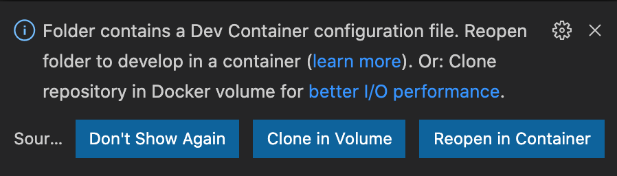

<p  align="center">


<a  href="https://www.twitter.com/pedrorenan/">

</a>
<a  href="https://github.com/tgmarinho/README-ecoleta/commits/master">

</a>

<a  href="https://github.com/pedrorenan/js-expert-week/stargazers">

</a>
</p>

### Pré-requisitos

 
Desde que você tenha instalado no seu computador [Docker](https://www.docker.com/get-started), o [VSCode](https://code.visualstudio.com/download) e a extensão [Remote-Containers](https://marketplace.visualstudio.com/items?itemName=ms-vscode-remote.remote-containers), não tem pré-requisito algum, é só rodar o projeto! 😲

  

Instruções:

  
```bash
# Clone este repositório
$ git clone https://github.com/pedrorenan/js-expert-week.git

# Acesse a pasta do projeto no terminal/cmd
$ cd js-expert-week

# Abra o projeto com o VSCode
$ code .
```

Quando o [VSCode](https://code.visualstudio.com/download) abrir você verá uma mensagem informando que foram detectadas as configurações necessárias para que a extensão [Remote-Containers](https://marketplace.visualstudio.com/items?itemName=ms-vscode-remote.remote-containers) faça a mágica acontecer.


<p  align="center">



</p>

  

Clique em "Reopen in Container". O [VSCode](https://code.visualstudio.com/download) vai reiniciar e é só aguardar o ambiente ficar pronto para você. Pode demorar um pouco na primeira vez se você nunca tiver feito o download dos containers necessários 🕐. Mas vale a pena!
  

Quando finalizar, você terá um terminal dentro do [VSCode](https://code.visualstudio.com/download) que já está dentro do container. Tudo integrado! Tipo [Inception](https://www.imdb.com/title/tt1375666/) mesmo 🍿.


💡 Tudo que você executar nesse terminal será executado dentro do container apenas!


>Eu escrevi um post sobre [VSCode](https://code.visualstudio.com/download) e [Remote-Containers](https://marketplace.visualstudio.com/items?itemName=ms-vscode-remote.remote-containers), se quiser ler um pouco mais sobre o assunto, é só acessar ["Em busca da independência para o ambiente de desenvolvimento"](https://medium.com/@pedrorenan/em-busca-da-independ%C3%AAncia-para-o-ambiente-de-desenvolvimento-2adc22f6f250).


## Aula 01

```bash
#rode o script que gera os vídeos em vários formatos
$ sh script.sh
```

>🕐 pode ser que demore um pouco, depende do seu ambiente aí. Verifica as pastas que vão sendo criadas em *assets/timeline*.